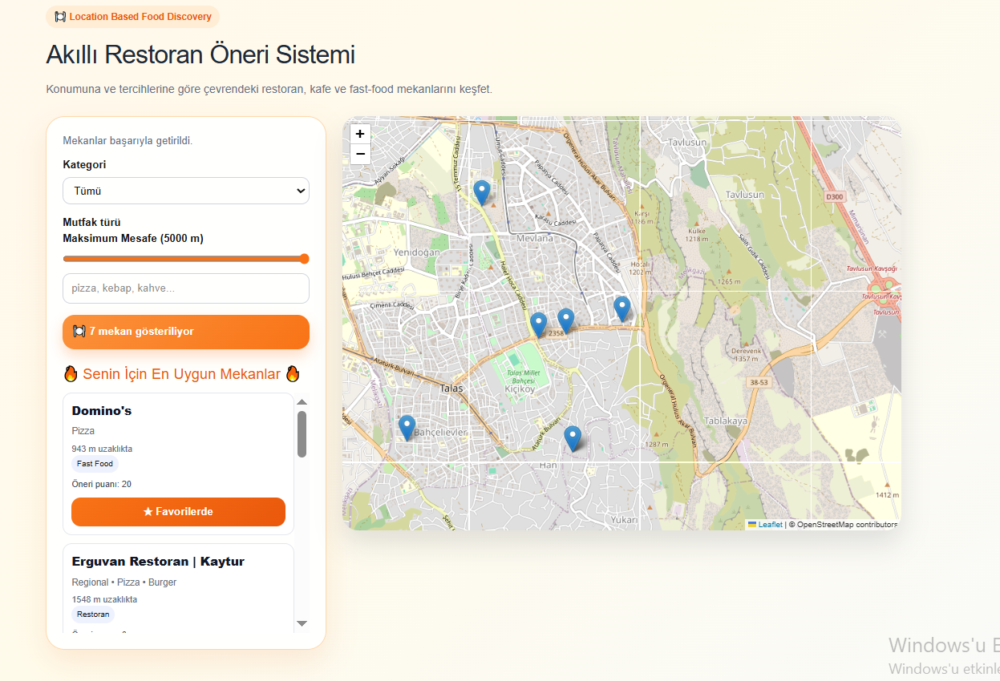

# Akıllı Restoran Öneri Sistemi

Kullanıcının konumunu kullanarak çevresindeki restoran, kafe ve fast-food mekanlarını keşfetmesini sağlayan konum tabanlı öneri sistemi.

## Proje Özeti

Bu proje, kullanıcının mevcut konumunu alarak çevredeki mekanları OpenStreetMap ve Overpass API üzerinden gerçek zamanlı olarak listelemektedir.

Kullanıcı;

- Mekan kategorisi seçebilir
- Mutfak türüne göre filtreleme yapabilir
- Maksimum mesafe belirleyebilir
- Mekanları favorilerine ekleyebilir
- Kendi tercihlerine göre sıralanmış öneriler alabilir

Tercihler ve favoriler LocalStorage üzerinde saklanmaktadır.

---

## Özellikler

### Konum Tespiti

- HTML5 Geolocation API kullanılarak kullanıcının mevcut konumu alınır.
- Kullanıcının konumu harita üzerinde gösterilir.

### Harita Entegrasyonu

- React Leaflet kullanılmıştır.
- OpenStreetMap haritaları görüntülenmektedir.

### Mekan Keşfi

- Yakındaki restoranlar
- Kafeler
- Fast-food mekanları

gerçek zamanlı olarak listelenmektedir.

### Filtreleme

Kullanıcı aşağıdaki kriterlere göre filtreleme yapabilir:

- Kategori
- Mutfak türü
- Maksimum mesafe

### Favoriler

Beğenilen mekanlar favorilere eklenebilir.

Favori mekanlar LocalStorage üzerinde saklanmaktadır.

### Öneri Algoritması

Öneri puanı şu kriterlere göre hesaplanmaktadır:

- Kategori eşleşmesi
- Mutfak tercihi eşleşmesi
- Favori mekan davranışı

Bu puanlara göre mekanlar sıralanmaktadır.

---

## Kullanılan Teknolojiler

- Next.js
- React
- TypeScript
- React Leaflet
- OpenStreetMap
- Overpass API
- LocalStorage

---

## Proje Yapısı

```text
app/
components/
services/
types/
public/
```

---

## Kurulum

```bash
git clone <repo-link>
cd location-based-restaurant-recommender

npm install
npm run dev
```

---

## Uygulama Görünümü

- Kullanıcı konumu
- Harita görünümü
- Filtreleme paneli
- Favoriler sistemi
- Kişiselleştirilmiş öneriler

---
## Uygulama Görünümü



## 👩‍💻 Geliştirici

Yaren Kumaş

Erciyes Üniversitesi
Bilgisayar Mühendisliği
